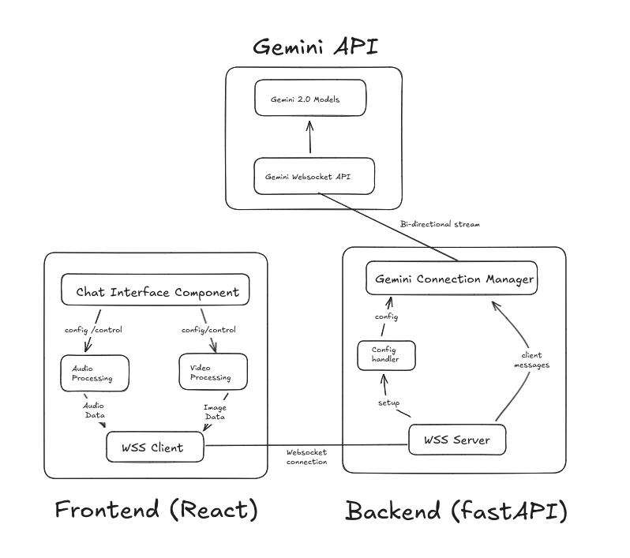

# Chat Interface System Architecture Summary

The Chat Interface System enables real-time communication using Gemini AI, supporting audio and image-based interactions. It is designed with a modular and resource-efficient architecture comprising three main components: **Frontend**, **Backend**, and **Gemini API Integration**.

---

## Frontend Architecture (React)

### Components
1. **Chat Interface Component**  
   - Manages application state, provides tabs for audio/video interactions, and handles configuration.  

2. **Audio Processing**  
   - Utilizes Web Audio API with 16kHz sampling and processes audio in 512-sample chunks, converting Float32 to PCM16 format.

3. **Video Processing**  
   - Captures video frames at 1-second intervals (320x240 resolution), converts them to JPEG using HTML Canvas, and mirrors video for user experience.

4. **WebSocket Client**  
   - Manages persistent connections, transmits audio (PCM), image (JPEG), and text data, and handles incoming audio responses.

---

## Backend Architecture (FastAPI)

### Components
1. **WebSocket Server**  
   - Handles bidirectional communication with clients, supports concurrent connections, and implements CORS for security.

2. **Gemini Connection Manager**  
   - Manages communication with Gemini API, handling audio, image, and text inputs, and streaming responses.

3. **Configuration Handler**  
   - Processes initial setup, including system prompts, voice settings, and model parameters.

---

## Data Flow

### Frontend → Backend
- **Configuration:** Sends initial settings (voice/system prompts).  
- **Audio:** Streams real-time PCM16 audio chunks.  
- **Image:** Sends JPEG snapshots at 1-second intervals.

### Backend → Gemini
- Configures the model and streams input data (audio, image, text).

### Gemini → Frontend
- Returns audio responses, text outputs, and completion signals.

---

## Security and Performance

### Security Features
- Unique client IDs, CORS protection, API key management, and resource cleanup.

### Performance Optimizations
- Chunked audio processing, frame rate control (1 fps for images), and efficient WebSocket usage.

---

## Technical Specifications

- **Audio Processing:**  
  - 16kHz sample rate, PCM 16-bit format, 512-sample buffer size.

- **Video Processing:**  
  - 320x240 resolution, JPEG format, 1 fps capture rate.

- **WebSocket Protocol:**  
  - Supports bidirectional streaming with JSON messages and heartbeat mechanisms.

---

## Key Features

- **Real-Time Bidirectional Communication:** Ensures seamless interaction between users and Gemini AI.  
- **Modular Design:** Facilitates maintainability and extensibility.  
- **Resource Management:** Efficiently handles audio, video, and WebSocket connections.  
- **Error Handling:** Comprehensive error reporting across all components.

This architecture provides a robust, scalable, and user-friendly chat system tailored for interactive AI-based communication.
